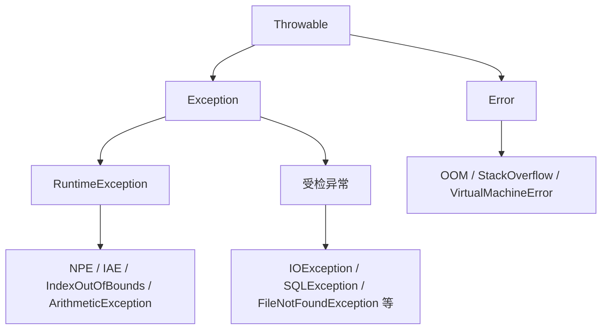

### 14、接口 vs 抽象类区别？什么时候用接口，什么时候用抽象类？（面试口述版）

**1）接口（interface）**  
- 更像“能力/规范”：强调你能做什么。  
- 支持多实现（一个类可以实现多个接口）。  
- Java 8 以后接口可以有 default 方法，但核心还是“规范”。

**2）抽象类（abstract class）**  
- 更像“模板/父类”：强调你是什么。  
- 只能单继承（extends 一个抽象类）。  
- 可以有成员变量、构造方法、抽象方法 + 已实现方法，适合复用公共代码。

**3）怎么选（面试一句话）**  
- 需要“多继承能力/解耦/定义规范” → 用接口。  
- 需要“复用公共代码/统一模板/有状态字段” → 用抽象类。

### 15、深拷贝 vs 浅拷贝？Cloneable 怎么用？为什么不推荐？（面试口述版）

**1）浅拷贝（Shallow Copy）**  
- 只复制对象本身；对象里的引用字段仍指向同一份子对象。

**2）深拷贝（Deep Copy）**  
- 不仅复制对象本身，还会把引用的子对象也复制一份，互不影响。

**3）Cloneable 怎么用（了解即可）**  
- 实现 Cloneable 接口，并重写 clone()（通常调用 super.clone()）。  
- 注意：super.clone() 默认是浅拷贝；要深拷贝需要手动 clone 子对象。

**4）为什么不推荐 clone**  
- 语义不清晰（浅拷贝/深拷贝容易踩坑）。  
- 需要处理 CloneNotSupportedException。  
- 容易破坏封装（直接绕过构造方法）。  
- 实际更常用：拷贝构造器、静态工厂、序列化/JSON（看场景）。

### 16、反射是什么？优缺点？常见使用场景（面试口述版）

**1）反射是什么**  
- 程序在运行时，可以获取类的结构信息，并动态地创建对象、调用方法、访问属性的一种机制。比如通过 Class.forName() 拿到类的元数据。

**2）优点**  
- 灵活：灵活性强，可以做通用框架、解耦（不依赖具体类）。

**3）缺点**  
- 性能开销较大：反射调用比直接调用慢、高频场景不适合大量使用  
- 破坏封装性：可以访问 private 成员  

**4）常见场景**  
- Spring：IOC、依赖注入、AOP  
- 注解：运行时读取注解做路由/校验/映射。  
- 动态代理：JDK Proxy 基于反射调用 InvocationHandler。

一句话总结：反射=运行时操作类结构；优点是灵活解耦；缺点是慢且不安全；框架用它做 IOC/注解/代理。

### 17、异常体系（面试口述版）

**体系图（继承关系）**  
Java 里所有“能抛的”都继承自 **Throwable**，下面分两支：**Error** 和 **Exception**。Exception 里又分“受检异常”和 **RuntimeException**（运行时异常，不受检）。图只画主干、一屏可览；常见子类列在下方。



**常见子类速查**（与上图对应）：  
- **Error**：OutOfMemoryError、StackOverflowError、VirtualMachineError 等。  
- **RuntimeException**：NullPointerException、IllegalArgumentException、IndexOutOfBoundsException、ArithmeticException 等。  
- **受检异常**：IOException、SQLException、InterruptedException、FileNotFoundException 等。

**1）Error vs Exception**  
- **Error**：JVM 层面的严重问题，程序一般无法/不应该去 catch（如 OOM、StackOverflowError、VirtualMachineError）。  
- **Exception**：程序运行中可预期、可处理的异常，需要捕获或抛出。

**Error 了程序还能运行吗？会崩溃吗？**  
- **直接结论：不 catch 时 = 不能，程序会挂。** Error 会一路向上抛，**当前线程会终止**；要是主线程或唯一干活的线程，程序就崩了。OOM、StackOverflowError 还可能让整个 JVM 退出。  
- **catch 了 Error 呢？** 理论上后面代码还能执行，但 JVM 可能已经不可信（堆/栈坏了），所以**一般不认为“还能正常跑”**，也不推荐随便 catch Error；只有最外层兜底打日志、做优雅退出时才考虑。  
**面试一句话：** 不 catch → 不能跑、线程挂甚至 JVM 退；catch 了理论上还能执行几句，但状态可能已坏，**正常答“不能当还能运行”就行**。

**2）RuntimeException vs Checked Exception**  
- **RuntimeException**（及其子类）：运行时异常，**编译器不强制** try-catch/throws；多是代码/参数问题（NPE、IndexOutOfBounds、IllegalArgument、ArithmeticException 等）。  
- **Checked Exception**（Exception 下除 RuntimeException 外的子类）：**编译器强制**处理（try-catch 或 throws）；多是外部环境问题（IOException、SQLException、InterruptedException 等）。

**3）try-catch-finally 执行顺序？finally 一定会执行吗？**  
- **直接结论：不一定会执行。** 正常情况（没 exit、进程没死）下会执行：顺序是 try →（有异常走 catch）→ finally，finally 用来释放资源（close/unlock）。  
- **不会执行的情况（面试说这两点就行）**：  
  - 调用了 **System.exit()**：JVM 直接退出，finally 根本不会跑。  
  - **进程被 kill、崩溃**（如 OOM 把 JVM 干掉）：没机会跑到 finally。  
- 可以理解为：**只有这两种情况（exit() 或进程挂了），才不会执行 finally**；除此以外，只要程序正常在跑，try/catch 走完就会进 finally。  
**面试一句话：** 正常流程下会执行；但 **System.exit()** 或**进程挂了**时不会执行，所以不能说“一定”会执行。  

**4）自定义异常怎么设计？什么时候抛业务异常？**  

**自定义异常怎么设计（说清楚）：**  
- **继承谁**：业务异常一般继承 **RuntimeException**，这样调用链上不用到处写 throws，上层在 Controller 或统一异常处理里一次性 catch 即可。  
- **类里有什么**：至少带 **错误码（code）** 和 **错误信息（message）**；可选带**上下文**（如 orderId、userId），方便日志排查和前端展示。例如：`throw new BizException("STOCK_NOT_ENOUGH", "库存不足", orderId)`。  
- **命名**：见名知意，如 `OrderNotFoundException`、`InsufficientStockException`，或统一用一个 `BizException` 用错误码区分。  
- **和系统异常区分开**：**业务异常** = 用户操作或业务规则导致、可预期、要给用户明确提示（如“库存不足”）；**系统异常** = 数据库挂、网络超时等、一般不直接暴露给用户，统一转成 500 或通用错误页。

**什么时候抛业务异常（说清楚）：**  
- **参数不合法**：id 为空、金额为负、必填项缺失 → 抛参数异常（如 IllegalArgumentException）或自定义 ParamInvalidException，错误码如 PARAM_INVALID。  
- **业务规则不满足**：库存不足、订单已关闭不能支付、权限不足、状态不允许操作 → 抛自定义业务异常，带明确错误码（如 STOCK_NOT_ENOUGH、ORDER_CLOSED），方便前端或网关按码返回文案。  
- **资源不存在**：根据 id 查订单/用户发现没有 → 抛 NotFoundException 或业务异常，对应 HTTP 404。  
- **希望上层统一处理时**：在 Service 层抛，在 Controller 层或全局 @ControllerAdvice 里 catch，根据异常类型/错误码转成 HTTP 状态码和统一响应体，避免每层都 try-catch。

**面试一句话：** 业务异常继承 RuntimeException，带错误码+消息+可选上下文；参数不合法、业务规则不满足、资源不存在时抛，上层统一捕获后按错误码返回给前端。

整节一句话：Error 别硬扛；Exception 要处理；运行时异常多是代码问题、受检异常多是外部问题；finally 负责收尾；业务异常用 RuntimeException + 错误码。

### 18、volatile 作用？（面试口述版）

**1）能保证什么**  
volatile 是一个轻量级并发关键字，用来保证“可见性”和“有序性”。  
- 保证可见性：保证一个线程的修改，会立即刷新到主内存中，对其他线程立即可见。  
- 保证有序性（禁止指令重排序）：JVM 和 CPU 可能会对指令进行重排序，比如 `a = new Object();` 理想顺序下，其实至少三步：分配内存、初始化对象、把对象引用赋值给 a。但在多线程下可能导致逻辑错误，比如第二步和第三步的顺序对调了。

**2）不能保证什么**  
- 不保证原子性：i++ 这种复合操作（读→改→写）仍然不是原子操作，多线程下会丢更新。

**3）要原子性怎么办？**  
volatile **本身做不到**原子性，也没有“用 volatile 实现原子性”这种写法；要原子性**必须换别的机制**，不能用 volatile 替代：  
- **synchronized**：把“读-改-写”整段包在同步块里，例如 `synchronized (lock) { count++; }`。  
- **原子类（AtomicXxx）**：用 `AtomicInteger`、`AtomicLong` 等，内部用 CAS，例如 `atomicCount.incrementAndGet()` 替代 i++。  
- **Lock（ReentrantLock）**：在 lock() 和 unlock() 之间做复合操作。  

**面试一句话：** volatile 只保证可见性和有序性，不保证原子性；要原子性**不能靠 volatile**，只能改用 synchronized、AtomicXxx 或 Lock。

**4）常见使用场景**  
- **单例模式里有一种创建方式是双重检测**，里面用到了 volatile：在**声明单例对象时**加上 volatile，例如 `private static volatile MyClass instance;`。这里用到 volatile 的**有序性**和**可见性**。因为 `new` 一个对象实际分三步：第一步分配内存空间，第二步创建对象，第三步赋值对象引用。第二步和第三步在多线程下可能被 JVM 优化而调换执行顺序，导致别的线程拿到引用时对象还没初始化完。对 instance 加 volatile 可以禁止这种重排，保证顺序正确，同时保证修改对其他线程可见。

### 19、ThreadLocal 原理？为什么会内存泄漏？怎么避免？（面试口述版）

**1）ThreadLocal 是什么**  
- ThreadLocal 是“线程本地变量”：同一个 ThreadLocal，在不同线程里各有一份值，互不影响。

**2）底层原理**  
- 每个线程 Thread 内部都有一个 ThreadLocalMap。  
- ThreadLocalMap 的 key 是 ThreadLocal（弱引用），value 是你存的对象。

**3）为什么会内存泄漏**  
- key 是弱引用：ThreadLocal 没有强引用时，key 可能被 GC 掉，变成 null。  
- 但 value 是强引用：如果线程一直不结束（线程池线程），value 可能一直挂在 ThreadLocalMap 里，导致内存泄漏。

**4）怎么避免**  
- 用完一定 remove：try/finally 里 ThreadLocal.remove()。  
- 线程池场景尤其要 remove（线程复用，最容易泄漏/串数据）。

### 20、线程池和 ThreadLocal 搭配一起用会有什么问题？（面试口述版）

- 核心原因：线程池会复用线程，但 ThreadLocal 的值是“挂在线程上的”，不会自动清理。  
- 常见问题：  
  - 串数据：上一个任务没清理，下一个任务可能读到上一个请求的用户信息/租户 ID/traceId。  
  - 内存泄漏：线程长期不结束，ThreadLocalMap 里的 value 可能长期占用内存（尤其是大对象）。  
  - 上下文传递坑：InheritableThreadLocal 只对“新建线程”生效，在线程池里常常不生效或拿到旧值。  
- 解决方案（背这句）：**用完必清理（try/finally remove），别放大对象；需要跨线程传递就用任务包装/TTL 统一传递与清理。**

### 21、synchronized 底层原理（面试口述版）

synchronized 是 Java 的**内置互斥锁**，底层靠**对象头里的 Mark Word + Monitor（监视器锁）**实现互斥，JDK1.6 之后又做了**锁优化**（偏向锁、轻量级锁、重量级锁）提升性能。

**原理**  
锁是加在**对象**上的。对象内存布局里有**对象头**，对象头里最重要的一块叫 **Mark Word**，里面存 hashcode、GC 年龄、**锁状态**，偏向锁时还会存线程 ID，重量级锁时存**指向 Monitor 的指针**——所以锁信息就存在 Mark Word 里。  
synchronized 真正做互斥依赖 **Monitor**：每个对象都能关联一个 Monitor。线程进同步块对应字节码 **monitorenter**，出块对应 **monitorexit**。JVM 会尝试获取这个对象的 Monitor，拿到就进临界区执行，拿不到就进 **EntryList** 阻塞等待，等持锁线程释放后再被唤醒竞争。这样同一时刻只有一个线程能当 owner，实现互斥。早期没有优化时，用的就是这种重量级锁，依赖操作系统 **Mutex**，成本高。

**锁优化**  
JDK1.6 引入了**锁升级**：无锁 → 偏向锁 → 轻量级锁 → 重量级锁；另外在抢不到锁时会用到**自旋**（有人也把这类机制叫**自旋锁**）。  
只有一个线程反复进同步块时，用**偏向锁**：在 Mark Word 里记下线程 ID，下次同一线程来不用再 CAS，直接进，减少重复加锁开销。  
多线程交替执行、几乎不同时抢锁时，用**轻量级锁**：在线程栈上建 **Lock Record**，用 **CAS** 把对象 Mark Word 复制过去并改指向；CAS 成功就拿到锁，**失败就先自旋**（不立刻阻塞，而是循环重试几次），自旋还拿不到再升级成重量级锁。这种“抢不到就循环试几次”就是**自旋锁**的思路，适合锁很快会释放的场景，避免马上挂起。JDK 还有**自适应自旋**，会根据以往自旋是否成功来调整自旋次数。  
竞争很激烈时，锁会**膨胀**成**重量级锁**，走 Monitor，抢不到就阻塞、进 EntryList，依赖操作系统 Mutex。  
锁升级是**只升不降**的，不会从重量级再变回轻量级或偏向锁，避免频繁切换带来的开销。

补充：synchronized 是**可重入**的，同一线程对同一把锁能多次进入，Monitor 记重入次数；退出同步块或方法时**自动释放**，重入时退到最外层才真正释放。

### 22、多线程基础（面试口述版）

**1）线程和进程的区别**  
- 可以这样回答（口述版）：  
  进程就是程序的一次运行实例，有自己独立的内存空间和资源，不同进程之间默认不共享内存，是资源分配单位。  
  线程是进程里的执行单元，一个进程可以有多个线程，它们共享同一块内存，是 CPU 调度单位。

**2）线程怎么创建（常见 3 种）**  
- 继承 Thread：new MyThread().start()。  
- 实现 Runnable：new Thread(runnable).start()。  
- 线程池 + Callable/Future：提交任务拿 Future（生产更常用）。

**3）线程状态（6 个）**  
- NEW / RUNNABLE / BLOCKED / WAITING / TIMED_WAITING / TERMINATED。

**4）常见方法（面试常问）**  
- start vs run：start 才会真正启动新线程；run 只是普通方法调用。  
- sleep：让当前线程睡一会儿，不释放锁。  
- wait/notify：必须在 synchronized 内使用；wait 会释放锁；notify/notifyAll 唤醒等待线程。  
- join：等待另一个线程执行完。

### 23、线程池核心参数（ThreadPoolExecutor 7 参数，面试口述版）

线程池的核心是 ThreadPoolExecutor：

**ThreadPoolExecutor 3 个最重要的参数（面试可以这样说）：**  
- **corePoolSize（核心线程数）**  
  线程池里常驻的线程数量，上线后基本会一直存在。  
  当运行的线程 < corePoolSize 时：有新任务来，就直接新建线程执行，不进队列。  
  可以理解为：“平时保持这么多工人常驻干活”。

- **maximumPoolSize（最大线程数）**  
  线程池里能开的最大线程总数（核心 + 非核心）。  
  当队列满了，还来任务时，如果当前线程数 < maximumPoolSize，就会再开新线程（非核心线程）处理。  
  可以理解为：“最多能临时拉这么多工人一起上”。

- **workQueue（任务队列）**  
  放“等待执行任务”的队列。  
  流程是：  
  - 先看当前运行线程数是否 < corePoolSize，是就新建核心线程执行；  
  - 否则，任务进队列等着；  
  - 队列也满了，再尝试开非核心线程（直到 maximumPoolSize）；  
  - 实在放不下，就走拒绝策略。  
  常见实现：ArrayBlockingQueue（有界数组）、LinkedBlockingQueue（链表，有界/无界）、SynchronousQueue（不存任务，直接交给线程）。

**ThreadPoolExecutor 其他常见参数：**  
- **keepAliveTime（非核心线程存活时间）**  
  当线程池里线程数大于 corePoolSize（也就是有非核心线程）时，这些非核心线程如果空闲了，不会立刻销毁，而是会“等一会儿”。等的这段时间就是 keepAliveTime；超过这个时间还没任务，就把这些非核心线程回收掉。所以它影响的是：高峰期结束后，临时加的线程多久收回。

- **unit（时间单位）**  
  就是 keepAliveTime 的时间单位，比如 TimeUnit.SECONDS、MILLISECONDS 等。

- **threadFactory（线程工厂）**  
  负责创建新线程的策略。可以用它来：给线程起统一、有含义的名字（方便排查问题）；设置是否是守护线程、优先级等。

- **handler（拒绝策略）**  
  当前线程数已经到 maximumPoolSize，队列也满了，新任务没地方放时，就会触发这个策略。  
  常见几种：  
  - AbortPolicy：直接抛异常（默认）。  
  - CallerRunsPolicy：由提交任务的线程自己执行（起到削峰作用）。  
  - DiscardPolicy：悄悄丢掉新任务。  
  - DiscardOldestPolicy：丢掉队列里最老的任务，把新任务加进去。

一句话记线程池执行流程（面试口述版）：  
- 先用核心线程处理任务；  
- 核心线程都忙不过来，任务进队列排队；  
- 队列也满了，就再开非核心线程，一直开到 maximumPoolSize；  
- 线程也满了、队列也满了，就触发拒绝策略（handler）。

### 24、Object 类的常见方法有哪些？（面试口述版）

- getClass()：获取对象的运行时类（Class），反射、类型判断时用。  
- equals(Object obj)：默认比较“引用是否同一个”；重写后用来比“内容是否相等”。  
- hashCode()：默认和对象地址相关；重写 equals 时一般要一起重写，满足哈希容器的约定。  
- toString()：默认返回 类名@十六进制 hashCode；重写后便于日志、调试打印。  
- clone()：浅拷贝，需实现 Cloneable；子类要重写并注意深拷贝问题，实际用得不多。  
- wait() / notify() / notifyAll()：和 synchronized 配合，做线程间等待与唤醒。  
- finalize()：GC 前可能调用，已不推荐使用，了解即可。

### 25、ArrayList 与 LinkedList 区别？（面试口述版）

- 底层结构：ArrayList 是动态数组，元素在内存中连续存放；LinkedList 是双向链表，节点之间通过指针前后相连。  
- 随机访问：ArrayList 通过下标随机访问是 O(1)，适合按索引读写；LinkedList 按下标访问需要从头/尾走一圈，是 O(n)。  
- 插入/删除：在中间位置频繁插入/删除时，ArrayList 需要搬移后面的元素，平均 O(n)；LinkedList 只要改前后指针，找到节点后是 O(1)。  
- 空间与缓存：ArrayList 连续存储，指针开销小，对 CPU 缓存友好，遍历性能好；LinkedList 每个节点多两个指针，内存开销大，缓存友好性差。  
- 使用场景总结：随机访问多、遍历多、插入删除不算频繁，用 ArrayList；极少数真的需要在中间频繁插删、且不怎么按下标访问时，才考虑 LinkedList（实际项目里用得相对少）。

---

### 26. 如何停止一个正在运行的线程？（答题要点）

**L：** 普通线程可以用**标志位**或 **`interrupt()`** 让线程**自己退出**；线程池线程要用 **`shutdown`** 或 **`shutdownNow`** 停止，同时**线程任务要能响应中断**，这样才能**安全退出**。

**「标志位」和「中断」分别是什么？（讲清楚版）**

- **标志位（协作式停止）**  
  - 就是**一个共享变量**，一般用 **`volatile boolean running = true`**（或 `AtomicBoolean`），表示「线程还要不要继续跑」。  
  - **工作线程**里用 **`while (running)`** 包住循环体；**别的线程**想停它时，把 **`running = false`** 即可。下一轮循环条件不成立，线程**自己结束**循环并退出 `run`。  
  - **含义：** 不是 JVM 帮你杀线程，而是**约定好一个开关**，子线程**主动读这个开关**决定退不退出。

```java
volatile boolean running = true;

// 工作线程里
while (running) {
    // 干活…
}
// 外部：running = false;  // 线程会在下一轮循环退出
```

- **`interrupt()`（中断请求）**  
  - 对目标线程调用 **`thread.interrupt()`**，是给这条线程打一个**「请尽快结束」的标记**（中断标志），**不是立刻把线程掐死**。  
  - **工作线程**里要在合适位置**检查**：**`Thread.currentThread().isInterrupted()`** 为 `true` 就 `break` / `return`；若线程正阻塞在 **`sleep` / `wait` / `join`** 等，会**抛出 `InterruptedException`**，在 `catch` 里结束循环或收尾（通常不要再 `sleep` 了）。  
  - **含义：** 一种**通知机制**，告诉线程「外面希望你停」，**停不停、怎么停**仍由线程里代码**配合处理**。

**两者区别（记一句）：**  
**标志位** = 你自己定义变量名、自己读、表示「业务上还要不要跑」；**`interrupt()`** = Java 提供的**标准中断标记**，和阻塞 API 的 **`InterruptedException`** 是一套，**线程池 `shutdownNow` 也会用 `interrupt` 唤醒工作线程**。

---

**`shutdown()` 和 `shutdownNow()` 有什么区别？**

**是不是「关闭整个线程池」？**  
**是的**——针对的是你调用的**这一个 `ExecutorService`（线程池）实例**：调用之后，这个池**不再接受新任务**，并开始**收尾**；池里那批**工作线程**会在任务执行完或被中断后**结束**，这个池**相当于被关掉**，**不能**再往里 `submit` 新活（再提交会抛异常或按拒绝策略走）。  
**注意：** 关的是**当前这个池**，不是关 JVM、也不是关别的线程池；以后要再用线程池需要 **new 新的** 或拿别的 `ExecutorService`。

| | **`shutdown()`** | **`shutdownNow()`** |
|---|------------------|---------------------|
| **新任务** | **不再接受**新提交的任务 | **不再接受**新提交的任务 |
| **已在队列里、还没执行的任务** | **会继续执行完**（按顺序跑） | **从队列里移除**，方法会**返回**这些任务的列表 |
| **正在执行的任务** | **不强行打断**，跑完为止 | **尝试 `interrupt` 工作线程**，能否立刻停取决于任务里**是否响应中断** |
| **适用** | 想**优雅收尾**：把手头活干完再关 | 想**尽快停**：队列里未开始的不要了，正在跑的尽量用中断打断 |

**面试一句话：** `shutdown` 是**温和关闭**——不接新活、队列里的会执行完；`shutdownNow` 更**激进**——清空等待队列并**中断**正在跑的线程，返回被取消的任务列表；两者都要任务代码**能处理中断**才真正停得干净。
