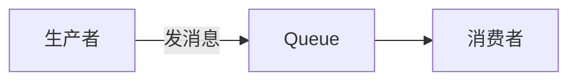
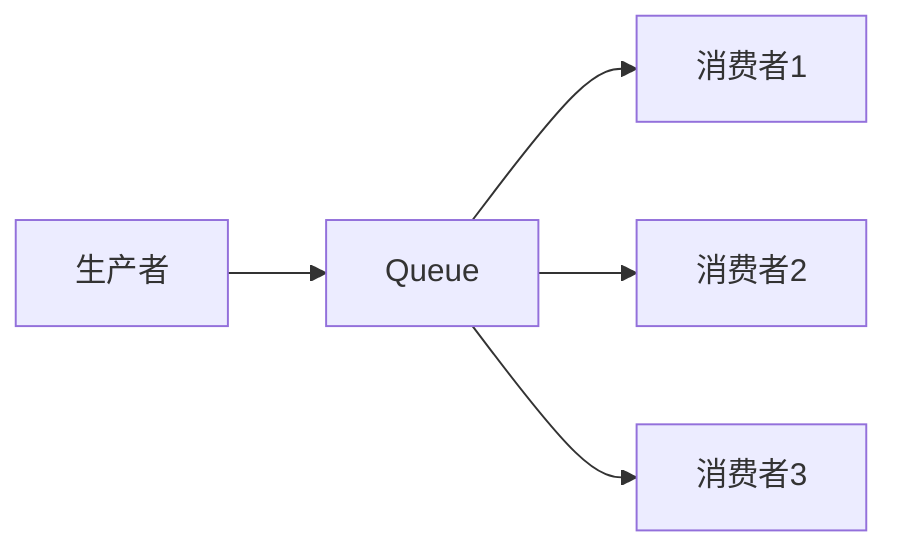
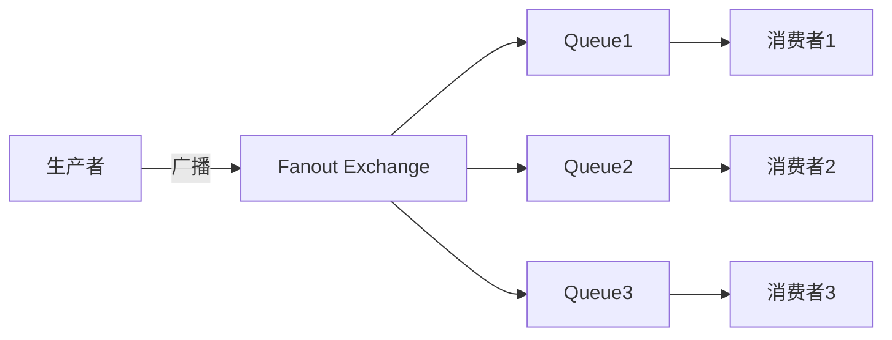
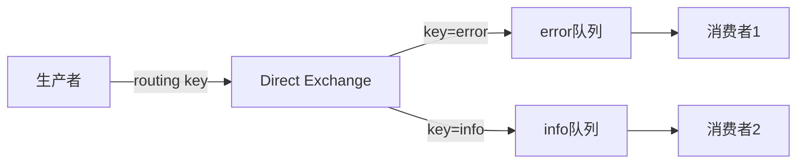
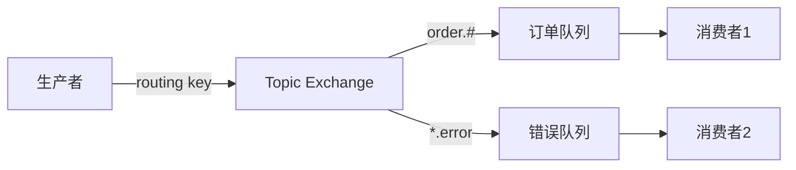
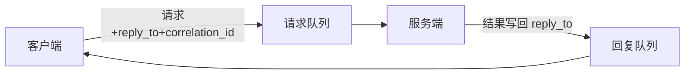

## RabbitMQ 面试题

**Broker 是什么？** 消息队列里说的 **Broker** 就是**消息队列服务器本身**：负责接收生产者发来的消息、写入队列、再推给消费者。在 RabbitMQ 里，Broker 指的就是你部署的 RabbitMQ 服务（单机或集群）；在 Kafka 里就是 Kafka 集群。生产者不直接连消费者，都连 Broker，由 Broker 中转。

### 1、如何保证 RabbitMQ 的消息都被处理？（面试口述版）

**背诵口诀：** 发有 confirm、存有持久化、消费有手动 ack、失败有重试或死信、业务做幂等。

**三条链路（按顺序背）：**

1）**生产者 → Broker**：开 Publisher Confirm，收到 confirm 才算发成功，否则重发；队列和消息都持久化，Broker 挂了重启消息还在。  
**持久化怎么做？** **队列持久化**：声明队列时设 `durable=true`，队列元数据会落盘，Broker 重启后队列还在。**消息持久化**：发消息时把 `deliveryMode` 设为 `2`（persistent），消息体会写入磁盘，Broker 重启后消息还在。只持久化队列不持久化消息，重启后队列在但消息会丢；两边都做才能防 Broker 宕机丢消息。  
2）**消费者**：用手动 ack，业务真正成功才 `basicAck`，Broker 才删消息；失败就 `basicNack`/`basicReject`，消息重新入队或进死信队列，再重试或人工处理。  
3）**防重复**：至少一次可能重复消费，业务侧做幂等（唯一键、状态机），避免同一条消息重复生效。  
**怎么理解？** “至少一次”表示宁可多处理也不能漏，所以失败会重试，同一条消息可能被投递、处理多次。如果业务不做防护，例如同一条“扣库存”消息处理两次就会扣两次。**幂等**的意思是：同一笔请求执行多次，效果和执行一次一样。做法举例：用**唯一键**（如订单号、消息 ID）在 DB 里做唯一约束，第二次插入会失败，自然就不会重复生效；或用**状态机**（如订单已支付就忽略重复的支付消息），只允许从当前状态流转到下一状态，重复消息来了发现状态不对就不处理。

**面试一句话：** 发用 confirm、存用持久化、消费用手动 ack 且先业务成功再 ack、失败走重试或死信，再配合业务幂等，保证消息都被处理且不重复生效。

**追问时可展开：** 生产者确认（RabbitMQ 用 Publisher Confirm，Kafka 用 acks）；消费者确认（RabbitMQ 手动 ack + prefetch，Kafka 手动提交 offset）；至少一次 / 至多一次 / 恰好一次 三种语义的区别。

### 2、RabbitMQ 消息积压如何处理？

当 RabbitMQ 消息出现积压时，我会从三个主要方面进行处理：

**提升消费者处理能力：**  
- 横向扩容：最直接有效的方式是增加消费者实例数量，让更多消费者并行处理消息，提高整体吞吐量。  
- 优化消费逻辑：对消费者业务逻辑进行优化，如将复杂耗时操作改为异步处理（快速 ACK），或采用批量处理机制，以提高单个消费者的处理效率。  
- 合理限流 (QoS)：通过 `basic.qos` 控制消费者一次性拉取的消息数量，避免单个消费者因处理过多消息而崩溃，保持处理的稳定性。

**优化 RabbitMQ 队列配置：**  
- 限制队列长度：通过 `x-max-length` (消息数) 或 `x-max-length-bytes` (总大小) 配置，避免队列无限膨胀，超出限制后可选择丢弃最老消息或发送到死信队列。  
- 消息 TTL (Time To Live)：为消息或队列设置过期时间，让超期未消费的消息自动清除或进入死信队列，避免无效消息长时间占用资源。  
- 死信队列 (DLQ)：配合 TTL 或消息拒绝机制，将过期、被拒或超长的消息路由到死信队列（DLQ），进行统一管理、分析和后续处理（如告警、重试），避免其影响主业务队列。  
- 优先级队列：针对核心业务消息，设置高优先级，确保在积压时能优先被处理，保障业务核心流程。

**系统级流量控制与保护：**  
- 消息分级：根据消息重要性，将不同等级的消息投递到不同的队列，甚至独立的 MQ 集群，确保核心业务通道的畅通和优先级。  
- 上游限流：在消息生产方进行流量控制（如令牌桶、漏桶算法），防止突发或过高的流量直接冲垮 MQ 或下游服务，从源头控制风险。  
- 下游熔断降级：当消息处理的下游服务出现故障或处理能力明显下降时，消费者可以暂停消费，或将消息路由到降级处理逻辑（如持久化到数据库稍后重试），避免故障蔓延导致整个系统雪崩。  
- 监控与报警：建立完善的监控体系，实时监测队列长度、消费者状态、消息生产消费速率等关键指标，并配置及时报警，以便在积压初期迅速发现问题并介入处理。

### 3、RabbitMQ 的六种工作模式（面试口述版）

下面用流程图把每种模式“谁连谁、消息怎么走”画出来，方便记忆。

**1）Simple 简单模式** — 一对一，直连队列

一个生产者、一个队列、一个消费者；无 Exchange 或走默认 Exchange，发到指定队列。

**2）Work Queues 工作队列** — 一队列多消费者，竞争消费

一条消息只被一个消费者拿到；轮询或公平分发，做任务分发、负载均衡。

**3）Publish/Subscribe 发布订阅** — Fanout 广播

消息发到 Fanout 交换机，**所有**绑定队列各收一份；适合一条消息推多个业务方。

**4）Routing 路由模式** — Direct 按 key 精确匹配

队列与 Exchange 用 **binding key** 绑定；消息的 routing key 与 binding key **完全一致**才进该队列。

**5）Topics 主题模式** — Topic 通配符匹配

`*` 匹配一个词，`#` 匹配零或多个词；如 `order.pay.success` 匹配 `order.#`，`api.error` 匹配 `*.error`。

**6）RPC 模式** — 请求-响应

客户端发请求时带上**回复队列 reply_to** 和**请求 id correlation_id**；服务端处理完后把结果发到 reply_to，客户端消费回复队列并根据 correlation_id 对上号。

---

**速查表**

| 模式 | Exchange 类型 | 路由方式 | 形象记忆 |
|------|----------------|----------|----------|
| Simple | 默认 | 直连指定队列 | 一根线 |
| Work Queues | 默认 | 一队多消费者抢 | 一根线分多叉 |
| 发布订阅 | Fanout | 广播，全发 | 一把扇子扇出去 |
| 路由 | Direct | routing key 精确匹配 | 按门牌号送 |
| 主题 | Topic | key 通配符 `*` `#` | 按规则订阅 |
| RPC | 默认/任意 | reply_to + correlation_id | 写信留回信地址 |

**参考图示（外部文章带图）：**  
- [RabbitMQ 原理和架构图解(附 6 大工作模式)](https://mikechen.cc/18353.html)  
- [RabbitMQ 超詳細解析，圖解六大模式應用場景](https://vocus.cc/article/65a3e6d4fd89780001e0c7b8)  
- [RabbitMQ 六种工作模式与应用场景（阿里云）](https://developer.aliyun.com/article/1288087)

**背诵要点：** Simple/Work 无 Exchange 或默认；发布订阅用 Fanout 广播；路由用 Direct 精确 key；主题用 Topic 通配符；RPC 用 reply_to + correlation_id。  
**面试一句话：** 六种模式记“简单 → 工作队列 → 发布订阅(Fanout) → 路由(Direct) → 主题(Topic) → RPC”；前五种是消息分发，RPC 是请求-响应。
